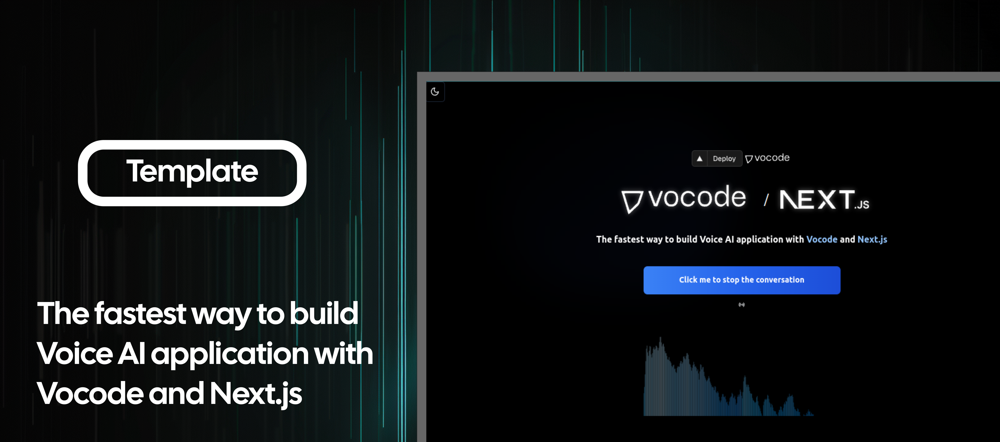

# Next.js/Vercel Template with Vocode's FastAPI Python Backend
[](https://vercel.com/new/clone?repository-url=https%3A%2F%2Fgithub.com%2FArtisanLabs%2Fvocode-next-vercel-template&env=OPENAI_API_KEY,DEEPGRAM_API_KEY,AZURE_SPEECH_KEY,AZURE_SPEECH_REGION)


This is a template for a [Next.js](https://nextjs.org/) project hosted on [Vercel](https://vercel.com/) that integrates with [Vocode's FastAPI Python backend](https://github.com/vocodedev/vocode-python). This template facilitates seamless communication between the Next.js frontend and the FastAPI backend, allowing developers to deploy a complete AI solution with Voice, Backend, and Frontend with just one click.

## Getting Started

First, clone the repository:

```bash
git clone https://github.com/vocodedev/vocode-nextjs-vercel-template.git
```

Then, install the dependencies:

```bash
npm install
# or
yarn install
```

To run the development server:

```bash
npm run dev
# or
yarn dev
```

Open [http://localhost:3000](http://localhost:3000) with your browser to see the result. The page auto-updates as you edit the file.

## Features

- Serverless Functions in Vercel: The template is configured with serverless functions using Python, ensuring compatibility with the FastAPI framework.
- FastAPI Integration: The template establishes a connection between the Vercel-hosted Next.js frontend and the FastAPI Python backend, ensuring efficient data exchange.

## Contributing

Contributions are welcome! Please read our [Contributing Guide](./CONTRIBUTING.md) and our [Code of Conduct](./CODE_OF_CONDUCT.md) for more information.

## License

This project is licensed under the [MIT License](./LICENSE).

## Contact

If you have any questions, feel free to open an issue or contact us directly at our [GitHub](https://github.com/vocodedev).
